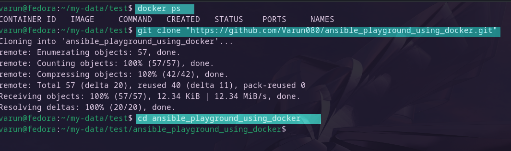
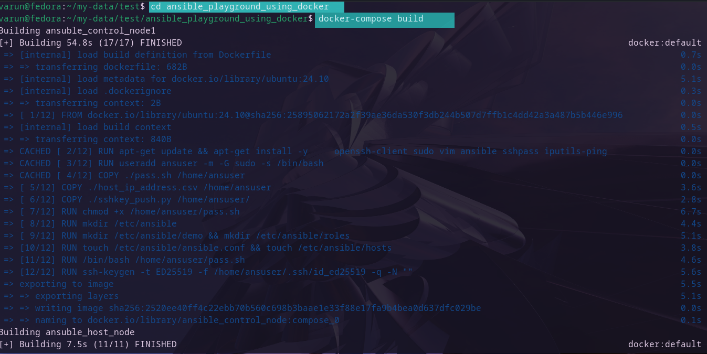
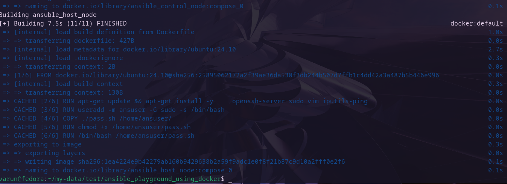
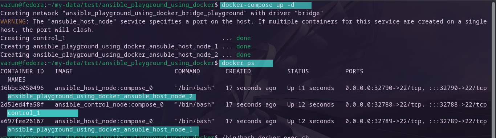
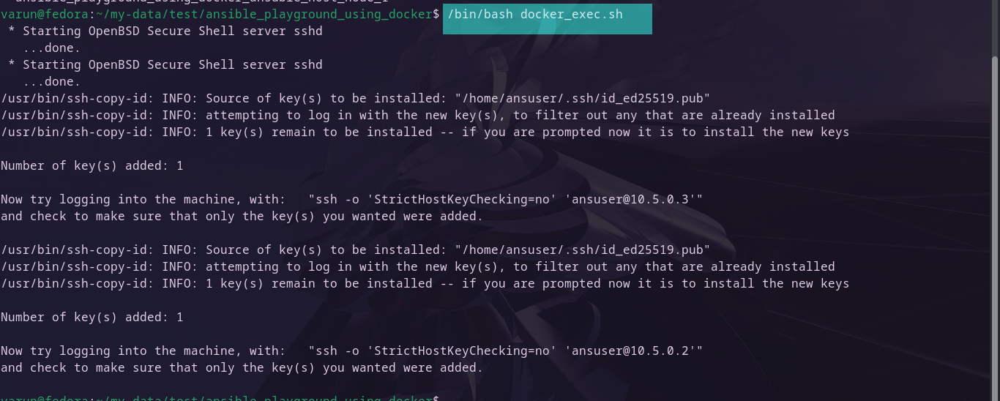
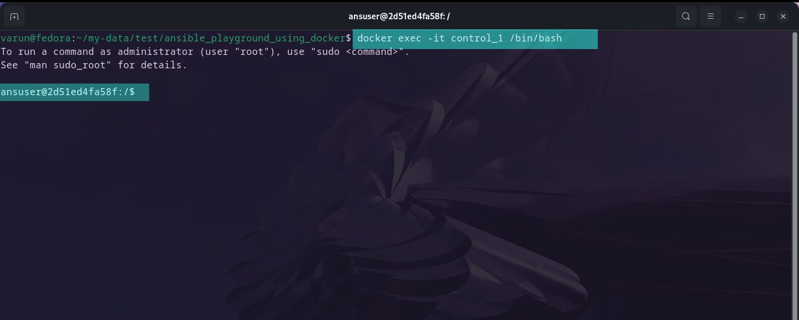
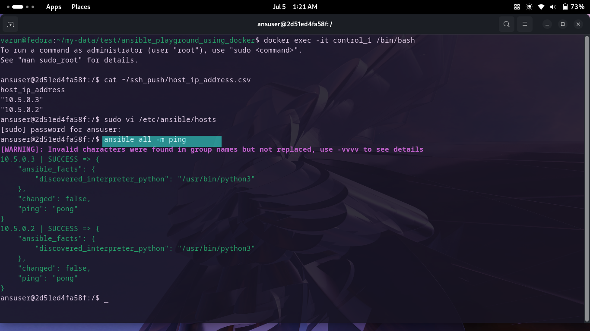

# ansible_playground_using_docker

This repository contains information and code to create Docker containers and images which will help in creating a sandbox-type environment to learn and practice ansible commands, configuration, and how the overall ansible environment works.

## Prerequisites

Below mentioned software needs to be installed on the local machine:

- Docker
- Docker-Compose
- Git
- Bash
- Python

## Process

Make sure Docker is running. Run the command below to confirm:

```bash
docker ps
```

Clone the repository:

```bash
git clone "https://github.com/Varun080/ansible_playground_using_docker.git"
```

Change to the directory:

```bash
cd ansible_playground_using_docker
```



Run the command below to build required images:

```bash
docker-compose build
```

|||
|:-:|:-:|
|||


Once completed, run the command below to create containers:

```bash
docker-compose up -d
```

It will create 1 control node and 2 host nodes. You can increase the number of host nodes by increasing the value of replicas in the compose.yml file.

You can check the created and running containers with the command below:

```bash
docker ps
```




Run the command below to complete the configuration of the containers. Run it with elevated privileges if required:

```bash
/bin/bash docker_exec.sh
```




This will start the sshd service on the host container and establish a password-less connection between host and control containers.

Now you can run the command below to connect to the control container and test Ansible ad-hoc commands and playbooks:

```bash
docker exec -it control_1 /bin/bash
```




To test if Ansible is working or not, update the `/etc/ansible/hosts` file in the control_1 container and run `ansible all -m ping` to check if ping is successful or not.





### To delete the environment :

Run below command, this will delete all the contaiers:

```bash
docker-compose down
```


## Important Data

- Username : ansuser

- Password : root
 
- SSH key type : ED25519
 
- Subnet range : 10.5.0.0/16 
 
- `control_1` ip address : 10.5.0.5
 
- Local machine ports used: 32789-32792 (additional ports can be added as per requirements)

- Base Image used : ubuntu:24.10
